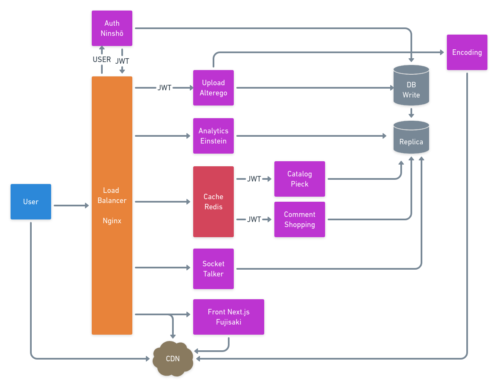

  <strong>A infrastructure for making scalable video sharing websites</strong>

 

# :paperclip: What is this?

Papier is an scalable website infrastructure to make it easier ot make scalable video sharing services.

# :construction: Structure

| Codebase             |    Description     |
| :------------------- | :----------------: |
| [ninsho](ninsho)     |      Auth API      |
| [alterego](alterego) |     Upload API     |
| [einstein](einstein) | Analytics Service  |
| [talker](talker)     |  Websocket Server  |
| [fujisaki](fujisaki) |   React Frontend   |
| [pieck](pieck)       |    Catalog API     |
| [shopping](shopping) | Comments/Likes API |

## How all microservices connect?

:construction: Need to update

## :palm_tree: Branches

| Branch |            Description            |
| :----- | :-------------------------------: |
| main   |        last stable version        |
| dev    |     pull request this branch      |
| prod   | running on production so dont use |

## :house: How to run locally?

You need to have `docker-compose`, `docker`, `go` and `node.js` installed in your machine in order to run locally.
